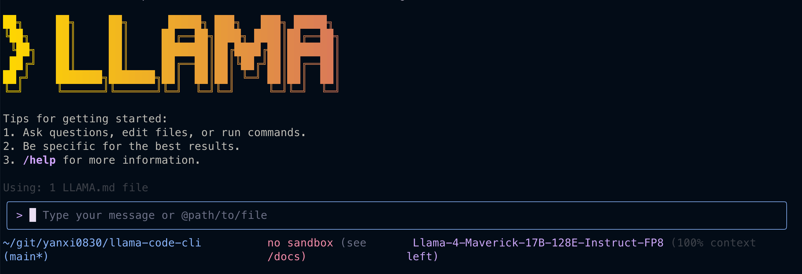

# Llama Code CLI

<div align="center">



**AI-powered command-line workflow tool for developers**

[Installation](#installation) • [Quick Start](#quick-start) • [Features](#key-features) • [Documentation](./docs/) • [Contributing](./CONTRIBUTING.md)

</div>

Llama Code is a powerful command-line AI workflow tool adapted from [**Qwen Code**](https://github.com/QwenLM/qwen-code/tree/main), which is adapter from [**Gemini CLI**](https://github.com/google-gemini/gemini-cli) ([details](./README.gemini.md)). It enhances your development workflow with advanced code understanding, automated tasks, and intelligent assistance.

## Key Features

- **Code Understanding & Editing** - Query and edit large codebases beyond traditional context window limits
- **Workflow Automation** - Automate operational tasks like handling pull requests and complex rebases

## Installation

### Prerequisites

Ensure you have [Node.js version 20](https://nodejs.org/en/download) or higher installed.

```bash
curl -qL https://www.npmjs.com/install.sh | sh
```

### Install from source

```bash
git clone git@github.com:yanxi0830/llama-code-cli.git
cd llama-code-cli
npm install
npm install -g .
```

## Quick Start

```bash
# Start Llama Code
llama

# Example commands
> Explain this codebase structure
> Help me refactor this function
> Generate unit tests for this module
```

### Session Management

Control your token usage with configurable session limits to optimize costs and performance.

#### Configure Session Token Limit

Create or edit `.llama/settings.json` in your home directory:

```json
{
  "sessionTokenLimit": 32000
}
```

#### Session Commands

- **`/compress`** - Compress conversation history to continue within token limits
- **`/clear`** - Clear all conversation history and start fresh
- **`/stats`** - Check current token usage and limits

> 📝 **Note**: Session token limit applies to a single conversation, not cumulative API calls.

### Authorization

Choose your preferred authentication method based on your needs:

#### OpenAI-Compatible API

Use API keys for OpenAI or other compatible providers:

**Configuration Methods:**

1. **Environment Variables**

   ```bash
   export LLAMA_API_KEY="your_api_key_here"
   export LLAMA_API_BASE_URL="your_api_endpoint"
   export LLAMA_API_MODEL="your_model_choice"
   ```

2. **Project `.env` File**
   Create a `.env` file in your project root:
   ```env
   LLAMA_API_KEY=your_api_key_here
   LLAMA_API_BASE_URL=your_api_endpoint
   LLAMA_API_MODEL=your_model_choice
   ```

## Usage Examples

### 🔍 Explore Codebases

```bash
cd your-project/
llama

# Architecture analysis
> Describe the main pieces of this system's architecture
> What are the key dependencies and how do they interact?
> Find all API endpoints and their authentication methods
```

### 💻 Code Development

```bash
# Refactoring
> Refactor this function to improve readability and performance
> Convert this class to use dependency injection
> Split this large module into smaller, focused components

# Code generation
> Create a REST API endpoint for user management
> Generate unit tests for the authentication module
> Add error handling to all database operations
```

### 🔄 Automate Workflows

```bash
# Git automation
> Analyze git commits from the last 7 days, grouped by feature
> Create a changelog from recent commits
> Find all TODO comments and create GitHub issues

# File operations
> Convert all images in this directory to PNG format
> Rename all test files to follow the *.test.ts pattern
> Find and remove all console.log statements
```

### 🐛 Debugging & Analysis

```bash
# Performance analysis
> Identify performance bottlenecks in this React component
> Find all N+1 query problems in the codebase

# Security audit
> Check for potential SQL injection vulnerabilities
> Find all hardcoded credentials or API keys
```

## Popular Tasks

### 📚 Understand New Codebases

```text
> What are the core business logic components?
> What security mechanisms are in place?
> How does the data flow through the system?
> What are the main design patterns used?
> Generate a dependency graph for this module
```

### 🔨 Code Refactoring & Optimization

```text
> What parts of this module can be optimized?
> Help me refactor this class to follow SOLID principles
> Add proper error handling and logging
> Convert callbacks to async/await pattern
> Implement caching for expensive operations
```

### 📝 Documentation & Testing

```text
> Generate comprehensive JSDoc comments for all public APIs
> Write unit tests with edge cases for this component
> Create API documentation in OpenAPI format
> Add inline comments explaining complex algorithms
> Generate a README for this module
```

### 🚀 Development Acceleration

```text
> Set up a new Express server with authentication
> Create a React component with TypeScript and tests
> Implement a rate limiter middleware
> Add database migrations for new schema
> Configure CI/CD pipeline for this project
```

## Commands & Shortcuts

### Session Commands

- `/help` - Display available commands
- `/clear` - Clear conversation history
- `/compress` - Compress history to save tokens
- `/stats` - Show current session information
- `/exit` or `/quit` - Exit Qwen Code

### Keyboard Shortcuts

- `Ctrl+C` - Cancel current operation
- `Ctrl+D` - Exit (on empty line)
- `Up/Down` - Navigate command history

## Development & Contributing

See [CONTRIBUTING.md](./CONTRIBUTING.md) to learn how to contribute to the project.

## Troubleshooting

If you encounter issues, check the [troubleshooting guide](docs/troubleshooting.md).

## Acknowledgments

This project is based on [Qwen Code](https://github.com/QwenLM/qwen-code/tree/main), which is based on [Google Gemini CLI](https://github.com/google-gemini/gemini-cli).

## License

[LICENSE](./LICENSE)
